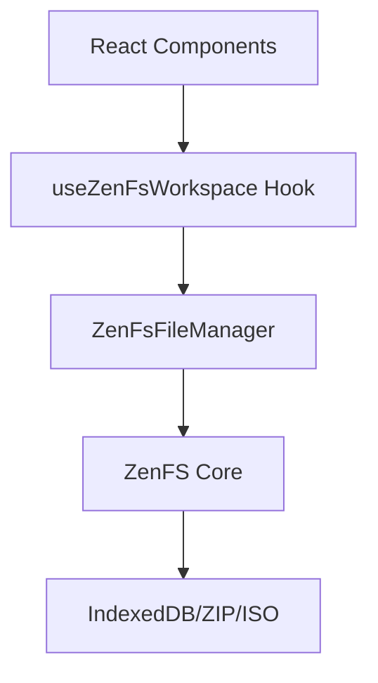

import { Tabs, TabItem, Steps, Card, CardGrid } from '@astrojs/starlight/components';

The Site Builder SDK provides a powerful browser-based file management system through ZenFS integration. This allows you to create, manage, and deploy websites entirely in the browser without any server infrastructure.

## Overview

Our file management system provides:

- 🌐 **Browser-based file system** - No server required, works entirely in the browser
- ⚡ **Real-time file watching** - Automatic updates when files change
- 📁 **Multiple backends** - IndexedDB, ZIP, and ISO support
- 🔄 **Asset preparation** - Automatic hash calculation and content processing
- 🏗️ **Workspace isolation** - Multiple projects in separate directories
- ⚛️ **React integration** - Ready-to-use hooks and components

## Architecture

The file management system consists of three layers:

1. **ZenFS Core** - Browser file system implementation
2. **File Manager** - Our wrapper with additional functionality
3. **React Integration** - Hooks and components for React apps



## Core File Manager

### Basic Setup

```typescript
import { ZenFsFileManager } from '@cmdoss/file-manager';

// Create a new file manager instance
const fileManager = new ZenFsFileManager('/my-workspace', 'indexeddb');

// Mount the file system
await fileManager.mount();

// Now you can work with files
await fileManager.writeFile('/index.html', '<h1>Hello World!</h1>');
const content = await fileManager.readFile('/index.html');
const files = await fileManager.listFiles();
```

### File Operations

<Tabs syncKey="file-ops">
<TabItem label="Write Files">

```typescript
// Write text content
await fileManager.writeFile('/index.html', '<h1>Hello World!</h1>');

// Write binary content
const imageData = new Uint8Array([/* image bytes */]);
await fileManager.writeFile('/logo.png', imageData);

// Write from File object (e.g., from file input)
const handleFileUpload = async (file: File) => {
  const content = new Uint8Array(await file.arrayBuffer());
  await fileManager.writeFile(`/${file.name}`, content);
};
```

</TabItem>
<TabItem label="Read Files">

```typescript
// Read file content as Uint8Array
const content = await fileManager.readFile('/index.html');

// Convert to string if it's text content
const textContent = new TextDecoder().decode(content);

// Read and process multiple files
const files = await fileManager.listFiles();
for (const filePath of files) {
  const content = await fileManager.readFile(filePath);
  console.log(`${filePath}: ${content.byteLength} bytes`);
}
```

</TabItem>
<TabItem label="File Watching">

```typescript
// Listen for file changes
const unsubscribe = fileManager.onFileChange((change) => {
  console.log(`File ${change.type}:`, change.path);
  
  if (change.type === 'updated') {
    console.log('File was created or updated');
  } else if (change.type === 'removed') {
    console.log('File was deleted');
  }
});

// Clean up listener when done
unsubscribe();
```

</TabItem>
<TabItem label="Cleanup">

```typescript
// Remove specific file
await fileManager.deleteFile('/old-file.txt');

// Unmount file system (cleanup)
fileManager.unmount();
```

</TabItem>
</Tabs>

## React Integration

### useZenFsWorkspace Hook

The main hook for React applications provides complete file management:

```typescript
import { useZenFsWorkspace } from '@cmdoss/site-builder-react';

function MyComponent() {
  const {
    assets,        // Array of IAsset objects ready for deployment
    loading,       // Boolean indicating if files are being loaded
    totalSize,     // Total size of all files in bytes
    fileManager,   // Direct access to file manager instance
    clear          // Function to clear all files
  } = useZenFsWorkspace('/workspace');
  
  // Assets are automatically updated when files change
  console.log(`Loaded ${assets.length} files (${totalSize} bytes)`);
}
```

### File Upload Component

Here's a complete file upload component:

```typescript
import { useZenFsWorkspace } from '@cmdoss/site-builder-react';
import { useCallback } from 'react';

function FileUploader() {
  const { fileManager, assets, loading } = useZenFsWorkspace();
  
  const handleFileUpload = useCallback(async (event: React.ChangeEvent<HTMLInputElement>) => {
    const files = event.target.files;
    if (!files || !fileManager) return;
    
    for (const file of Array.from(files)) {
      try {
        const content = new Uint8Array(await file.arrayBuffer());
        await fileManager.writeFile(`/${file.name}`, content);
        console.log(`Uploaded: ${file.name}`);
      } catch (error) {
        console.error(`Failed to upload ${file.name}:`, error);
      }
    }
  }, [fileManager]);
  
  const handleFolderUpload = useCallback(async (event: React.ChangeEvent<HTMLInputElement>) => {
    const files = event.target.files;
    if (!files || !fileManager) return;
    
    for (const file of Array.from(files)) {
      try {
        const content = new Uint8Array(await file.arrayBuffer());
        // Preserve folder structure using webkitRelativePath
        const path = file.webkitRelativePath || file.name;
        await fileManager.writeFile(`/${path}`, content);
        console.log(`Uploaded: ${path}`);
      } catch (error) {
        console.error(`Failed to upload ${file.name}:`, error);
      }
    }
  }, [fileManager]);
  
  return (
    <div className="file-uploader">
      <div className="upload-buttons">
        <label className="upload-button">
          📁 Upload Files
          <input
            type="file"
            multiple
            onChange={handleFileUpload}
            style={{ display: 'none' }}
          />
        </label>
        
        <label className="upload-button">
          📂 Upload Folder
          <input
            type="file"
            webkitdirectory="true"
            onChange={handleFolderUpload}
            style={{ display: 'none' }}
          />
        </label>
      </div>
      
      {loading && <p>Loading files...</p>}
      
      <div className="file-list">
        <h3>Files ({assets.length})</h3>
        {assets.map(asset => (
          <div key={asset.path} className="file-item">
            <span>{asset.path}</span>
            <span>{asset.content.byteLength} bytes</span>
          </div>
        ))}
      </div>
    </div>
  );
}
```

### File Explorer Component

Create a comprehensive file browser:

```typescript
import { useState } from 'react';
import { useZenFsWorkspace } from '@cmdoss/site-builder-react';
import type { IAsset } from '@cmdoss/site-builder';

interface FileExplorerProps {
  className?: string;
}

function FileExplorer({ className }: FileExplorerProps) {
  const { assets, fileManager } = useZenFsWorkspace();
  const [selectedFile, setSelectedFile] = useState<IAsset | null>(null);
  
  const handleFileSelect = (asset: IAsset) => {
    setSelectedFile(asset);
  };
  
  const handleFileDelete = async (asset: IAsset) => {
    if (!fileManager) return;
    
    try {
      await fileManager.deleteFile(asset.path);
      console.log(`Deleted: ${asset.path}`);
    } catch (error) {
      console.error(`Failed to delete ${asset.path}:`, error);
    }
  };
  
  const renderFileContent = (asset: IAsset) => {
    try {
      // Try to decode as text for common file types
      const textContent = new TextDecoder().decode(asset.content);
      return (
        <pre className="file-content">
          <code>{textContent}</code>
        </pre>
      );
    } catch {
      return <div>Binary file ({asset.content.byteLength} bytes)</div>;
    }
  };
  
  return (
    <div className={`file-explorer ${className}`}>
      <div className="file-tree">
        <h3>Files ({assets.length})</h3>
        {assets.map(asset => (
          <div 
            key={asset.path}
            className={`file-item ${selectedFile?.path === asset.path ? 'selected' : ''}`}
            onClick={() => handleFileSelect(asset)}
          >
            <span className="file-name">{asset.path}</span>
            <span className="file-size">{asset.content.byteLength}b</span>
            <button 
              onClick={(e) => {
                e.stopPropagation();
                handleFileDelete(asset);
              }}
              className="delete-button"
            >
              ❌
            </button>
          </div>
        ))}
      </div>
      
      {selectedFile && (
        <div className="file-preview">
          <h3>{selectedFile.path}</h3>
          {renderFileContent(selectedFile)}
        </div>
      )}
    </div>
  );
}
```

## Advanced Features

### Working with Different Backends

<Tabs syncKey="backends">
<TabItem label="IndexedDB">

```typescript
// Persistent storage in the browser
const fileManager = new ZenFsFileManager('/workspace', 'indexeddb');
await fileManager.mount();

// Files persist across browser sessions
// Good for: Development, user projects
```

</TabItem>
<TabItem label="ZIP Archive">

```typescript
// Load from ZIP file
const zipFile = await fetch('/template.zip').then(r => r.arrayBuffer());
const fileManager = new ZenFsFileManager('/workspace', 'zip');
await fileManager.mount(zipFile);

// Read-only access to ZIP contents
// Good for: Templates, static content
```

</TabItem>
<TabItem label="ISO Image">

```typescript
// Load from ISO file
const isoFile = await fetch('/project.iso').then(r => r.arrayBuffer());
const fileManager = new ZenFsFileManager('/workspace', 'iso');
await fileManager.mount(isoFile);

// Read-only access to ISO contents
// Good for: Large archives, CD/DVD images
```

</TabItem>
</Tabs>

### Template System

Create reusable website templates:

```typescript
const createTemplate = async (templateName: string) => {
  const templates = {
    'basic-html': {
      'index.html': `<!DOCTYPE html>
<html>
<head>
  <title>My Website</title>
  <link rel="stylesheet" href="style.css">
</head>
<body>
  <h1>Welcome to my website!</h1>
</body>
</html>`,
      'style.css': `body {
  font-family: Arial, sans-serif;
  margin: 0;
  padding: 20px;
  background-color: #f0f0f0;
}

h1 {
  color: #333;
  text-align: center;
}`
    },
    'react-spa': {
      'index.html': `<!DOCTYPE html>
<html>
<head>
  <title>React App</title>
</head>
<body>
  <div id="root"></div>
  <script src="app.js"></script>
</body>
</html>`,
      'app.js': `// React app bundle would go here
console.log('React app loaded');`
    }
  };
  
  const template = templates[templateName];
  if (!template) throw new Error(`Template "${templateName}" not found`);
  
  for (const [path, content] of Object.entries(template)) {
    await fileManager.writeFile(path, content);
  }
};

// Usage
await createTemplate('basic-html');
```

### File Processing Pipeline

When using the file manager with the SDK, files are automatically processed during deployment. You don't need to manually calculate hashes - the SDK handles this for you:

```typescript
import { WalrusSiteBuilderSdk } from '@cmdoss/site-builder';
import { ZenFsFileManager } from '@cmdoss/file-manager';

// Initialize file manager
const fileManager = new ZenFsFileManager('/workspace');
await fileManager.initialize();

// Add files to workspace
await fileManager.writeFile('/index.html', new TextEncoder().encode('<h1>Hello</h1>'));
await fileManager.writeFile('/style.css', new TextEncoder().encode('body { color: blue; }'));

// The SDK will automatically process files during deployment
const sdk = new WalrusSiteBuilderSdk(walrusClient, suiClient, walletAddr, signAndExecuteTransaction);
const deployFlow = sdk.executeSiteUpdateFlow(fileManager, wsResources);

// All file processing (encoding, hashing) happens automatically
await deployFlow.prepareResources();
await deployFlow.writeResources(57, false);
const { certifiedBlobs } = await deployFlow.certifyResources();
const { siteId } = await deployFlow.writeSite();
```

For advanced use cases where you need to process files before adding them to the workspace:
  
  return processedAssets;
};
```

## Best Practices

<CardGrid>
  <Card title="File Organization">
    - Use forward slashes for paths (`/folder/file.html`)
    - Keep file names web-safe (no spaces, special characters)
    - Organize with clear folder structure
    - Use lowercase file names for consistency
  </Card>
  
  <Card title="Performance">
    - Batch file operations when possible
    - Use file watching instead of polling
    - Clear unused workspaces to save memory
    - Compress large files before storage
  </Card>
  
  <Card title="Error Handling">
    - Always handle file operation errors
    - Validate file sizes before writing
    - Check available storage space
    - Provide user feedback for long operations
  </Card>
  
  <Card title="Security">
    - Validate file types before upload
    - Sanitize file names and paths
    - Limit file sizes and total workspace size
    - Don't store sensitive data in browser storage
  </Card>
</CardGrid>

## Troubleshooting

### Common Issues

**Files not persisting across browser sessions**
```typescript
// Ensure you're using IndexedDB backend
const fileManager = new ZenFsFileManager('/workspace', 'indexeddb');
```

**Memory issues with large files**
```typescript
// Process files in chunks for large uploads
const processLargeFile = async (file: File) => {
  const chunkSize = 1024 * 1024; // 1MB chunks
  const chunks = [];
  
  for (let i = 0; i < file.size; i += chunkSize) {
    const chunk = file.slice(i, i + chunkSize);
    chunks.push(new Uint8Array(await chunk.arrayBuffer()));
  }
  
  // Combine chunks
  const combined = new Uint8Array(file.size);
  let offset = 0;
  for (const chunk of chunks) {
    combined.set(chunk, offset);
    offset += chunk.length;
  }
  
  return combined;
};
```

**File watching not working**
```typescript
// Ensure proper cleanup of listeners
useEffect(() => {
  if (!fileManager) return;
  
  const unsubscribe = fileManager.onFileChange((change) => {
    // Handle file changes
  });
  
  return () => {
    unsubscribe(); // Important: cleanup listener
  };
}, [fileManager]);
```

## Next Steps

- **[Deployment Flow](/guides/deploy-flow/)** - Learn to deploy your files
- **[Cost Calculation](/guides/cost-calculation/)** - Understand storage costs  
- **[Examples](/examples/)** - See complete working examples
- **[API Reference](/reference/)** - Detailed API documentation