# Site Builder SDK

A TypeScript SDK for building and deploying decentralized websites on Walrus + Sui, with integrated file operations using zenfs.

## Features

- 🚀 **Site Management**: Create, update, and manage decentralized websites
- 📁 **File Operations**: Advanced file handling with zenfs integration
- 🔧 **Type Safety**: Full TypeScript support with comprehensive type definitions
- 🧪 **Testing**: Complete test suite with Node.js test runner
- 🌐 **Web Compatible**: Works in both Node.js and browser environments

## Installation

```bash
npm install @cmdoss/site-builder
```

## Quick Start

```typescript
import { WalrusSiteBuilderSdk } from '@cmdoss/site-builder'
import { ZenFsFileManager } from '@cmdoss/file-manager'
import { SuiClient } from '@mysten/sui/client'
import { WalrusClient } from '@mysten/walrus'

const suiClient = new SuiClient({ url: 'https://fullnode.example.com' })
const walrusClient = new WalrusClient({ suiClient })
const fileManager = new ZenFsFileManager()

const sdk = new WalrusSiteBuilderSdk({
  suiClient,
  walrusClient,
  fileManager,
  signAndExecuteTransaction: async (tx) => {
    // Your wallet signing implementation
  }
})

// Deploy a site
await sdk.publishSite({
  siteDataPath: '/path/to/site',
  numEpochs: 100
})
```

## File System Integration

This SDK uses [zenfs](https://github.com/zen-fs/core) for file operations, providing:

- **Cross-platform compatibility**: Works in Node.js and browsers
- **Memory-efficient**: Handles large files without blocking
- **Type-safe**: Full TypeScript integration
- **Feature-rich**: Advanced file operations and metadata

## Architecture

The SDK follows a modular architecture:

```mermaid
graph TD
    A["🚀 WalrusSiteBuilderSdk<br/>Entry Point"] --> B["📋 UpdateWalrusSiteFlow<br/>Deployment Orchestrator"]
    B --> C["📊 prepareResources<br/>Compute Diff & Validate"]
    C --> C2["🔧 encodeResources<br/>Encode into Blobs"]
    C2 --> D["📤 writeResources<br/>Upload to Walrus"]
    D --> E["✅ certifyResources<br/>Associate Certificates"]
    E --> F["⛓️ writeSite<br/>Create Site on Sui"]
    A --> G["📁 IFileManager<br/>File Operations"]
    G --> H["🌐 Node.js & Browser<br/>Cross-platform"]
    
    style A fill:#4F46E5,stroke:#312E81,color:#fff,stroke-width:3px
    style B fill:#7C3AED,stroke:#5B21B6,color:#fff,stroke-width:3px
    style C fill:#EC4899,stroke:#BE185D,color:#fff,stroke-width:2px
    style C2 fill:#D946EF,stroke:#A21CAF,color:#fff,stroke-width:2px
    style D fill:#F97316,stroke:#C2410C,color:#fff,stroke-width:2px
    style E fill:#06B6D4,stroke:#0E7490,color:#fff,stroke-width:2px
    style F fill:#10B981,stroke:#065F46,color:#fff,stroke-width:2px
    style G fill:#8B5CF6,stroke:#6D28D9,color:#fff,stroke-width:3px
    style H fill:#6366F1,stroke:#3730A3,color:#fff,stroke-width:2px
```



**Key Components:**

- **WalrusSiteBuilderSdk**: Main entry point for site deployment
- **UpdateWalrusSiteFlow**: Orchestrates the deployment lifecycle
  - `prepareResources()`: Computes file diff and validates files
  - `encodeResources()`: Encodes files into blobs and computes blob IDs
  - `writeResources()`: Uploads blobs to Walrus storage
  - `certifyResources()`: Associates certificates with on-chain data
  - `writeSite()`: Creates/updates Site object on Sui blockchain
- **IFileManager**: Abstraction for file operations (supports both Node.js and browser)

For more details, see [AGENTS.md](../../AGENTS.md) in the root repository.

## Examples

See the [playground app](../../apps/playground) for comprehensive examples showcasing:

- Site creation and deployment
- File management
- Wallet integration
- Resource management
- Site updates and publishing

Refer to the package source in [src/](src/) for detailed API documentation.

## Contributing

1. Fork the repository
2. Create a feature branch
3. Add tests for new functionality
4. Ensure all tests pass
5. Submit a pull request

## License

MIT

## Acknowledgments

- Built on [Sui](https://sui.io/) blockchain infrastructure
- Uses [Walrus](https://walrus.xyz/) for decentralized storage
- File operations powered by [zenfs](https://github.com/zen-fs/core)
- Inspired by the original [Rust implementation](https://github.com/MystenLabs/walrus-sites)
